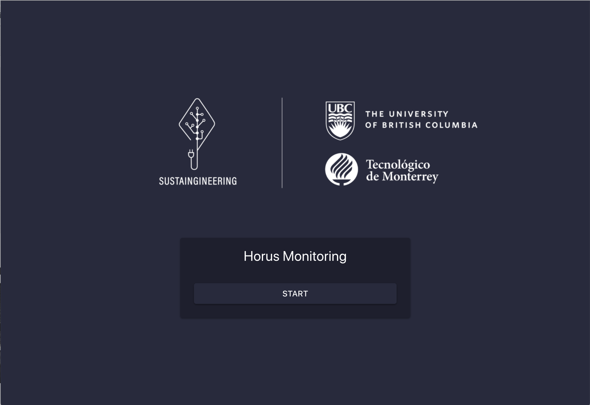
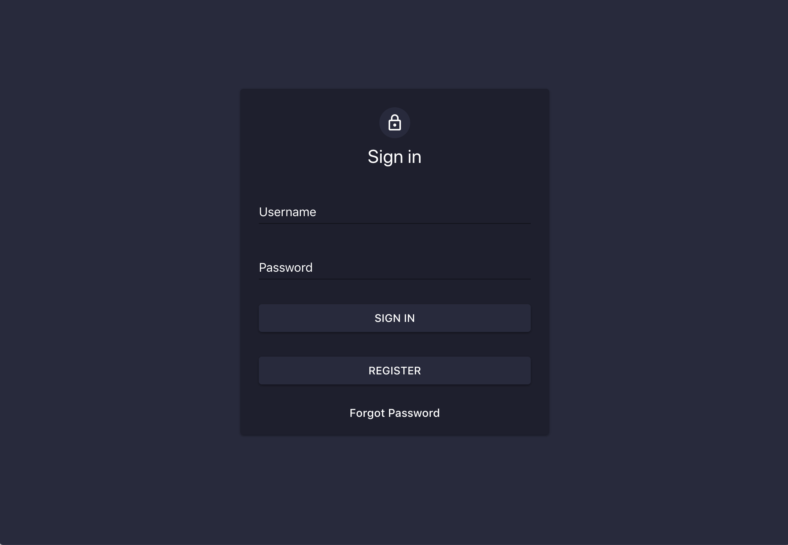
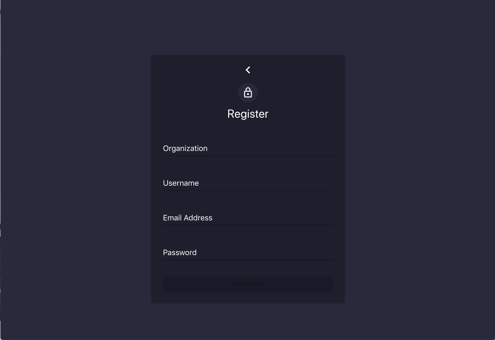
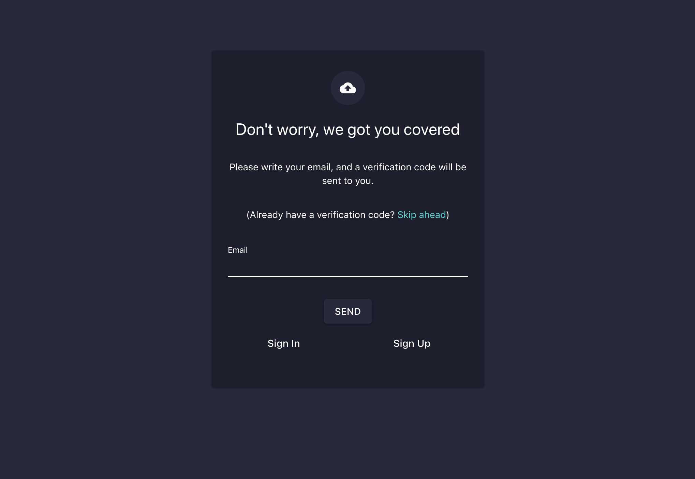
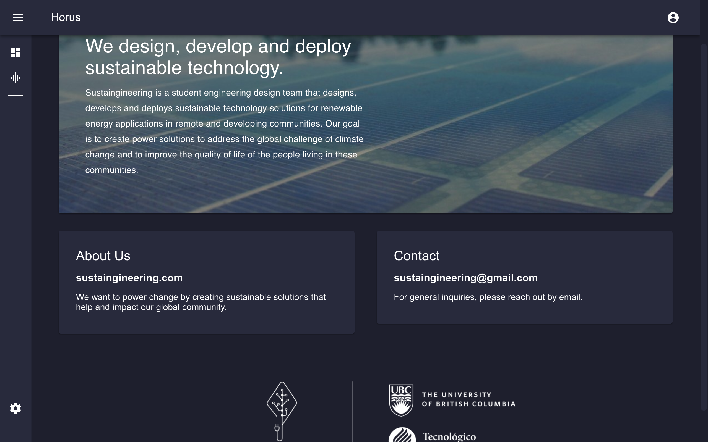
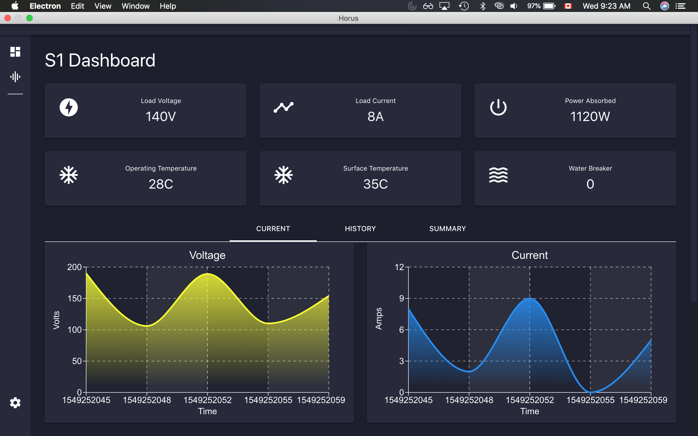
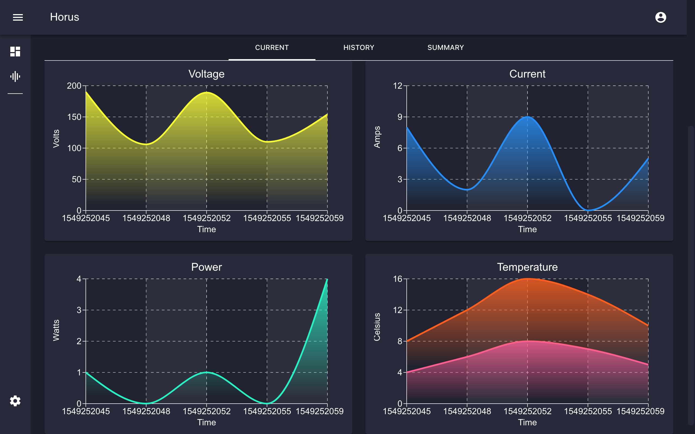
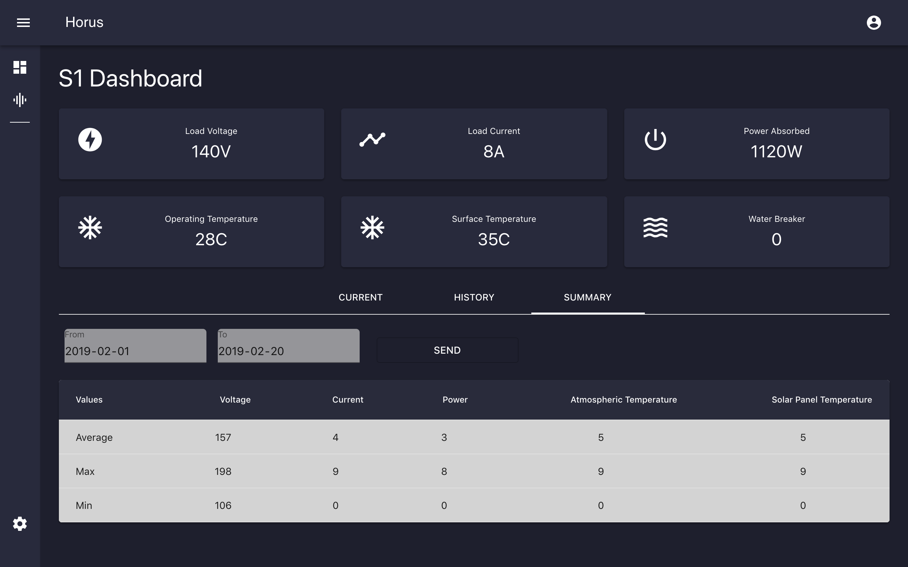

# Horus Monitoring build with React + Electron

[Sustaingineering at UBC](https://www.sustaingineering.com)

A remote monitoring system

UBC Sustaingineering is working in partnership with ENICALSA (Renewable solutions company in Nicaragua) to design and develop a 3G-network monitoring system for solar water pumps.

Horus an electron based desktop application (MacOS, Windows, Linux) aims to facilitate the monitoring and data collection for the 30 currently installed solar panels in Nicargua.

## Presentational Images
The following section will present some images of the application running

##### Landing Page

##### Sign In Page

##### Sign Up Page

##### Forgot Password Page

##### Home Page

##### Sample Sensor Dashboard 

##### Sample Sensor Graphs

##### Sample Summary Table


## Getting Started

These instructions will get you a copy of the project up and running on your local machine for development and testing purposes.

### Prerequisites

We will install some essential Command Line Interfaces (CLI) to enable a connection between your local machine and required web services. 


(These are the general steps. This is still missing formating, content, but will serve as backbone for the whole file).

#### Mac OS

1. Installing Git in your shell. 

   1. Open up Terminal by typing "Terminal" on the Spotlight Search 
   
   2. Once open, type the following in the command line
   
      ```
      git
      ```
      
      The git command will prompt a wizard if you don't have git installed in your computer. Open the wizard and follow the instructions.
      
      You can retype git in the command line once installation is completed, which will open up a series of new options available to the git command. This ensures that the CLI was installed successfuly. 
     
2. Intalling Node Package Manager (npm) and Node Js

   1. Go to this site https://www.npmjs.com/get-npm. Choose the Mac option, then click download. 
    
   2. Open the downloaded file, which will prompt a wizard. Follow the instructions provided.
   
   3. Once installed, you can type the following command to check your current node version/ensure sucessful installation.
    
      ```
      node -v
      ```

### Application Installation

1. Clone the repository on your local machine

   1. Open up Terminal, and copy the following line
    
      ```
      git clone https://github.com/Sustaingineeringubc/Monitoring-System.git
      ```
    
      This will bind your local computer with the online repository, and download all the files, folders and information belonging to the project to a folder on your current directory.  
    
      *If you want to customize the location of the clone, you can traverse your directories at will with the use of the "Cd" + "folder name" command. More information about traversing your directories [here](https://macpaw.com/how-to/use-terminal-on-mac).*

2. Navigate to `Monitoring-System` directory

   1. In the command line, type the following command
    
      ```
      cd Monitoring-System
      ```
    
      You can always check your current directory by typing the following command
    
      ```
      pwd
      ```
    
      This will dispaly your current path, which should end with .../Monitoring-System
    

3. Install project dependencies

   1) Inside the Monitoring-System folder, type the following command
    
      ```
      npm install
      ```
    
      This will search for files inside the project that need to be downloaded for the project to run properly. A scrollbar will appear while your dependencies are being downloaded.  

4. Start the app

   1) Once download finishes, type the following command
    
      ```
      npm start    
      ```
    
      This will open up the Horus application, taking you to the landing screen. 

## Running the tests

Explain how to run the automated tests for this system

## Build

Building an electron project will generate an platfrom based native binary. This binary can then be used to install a Horus app distribution into Windows, MacOS and Linux.

1. Bulding the distribution

    ```
    npm run build
    ```

## Authors

* **Felipe Ballesteros** - *Team lead* - [FEBG](https://github.com/febg)
* **Adrian Viquez** - *Team Member* - [aviquez96](https://github.com/aviquez96)
* **Juan Luis Flores** - *Team Member* - [jluisfgarza](https://github.com/jluisfgarza)
* **Israel Trujillo** - *Team Member* - [israeltq](https://github.com/israeltq)
* **Omar Agha** - *Team Member* - [omaragha98](https://github.com/omaragha98)
* **John Song** - *Team Member* - [jarhun88](https://github.com/jarhun88)

See also the list of [contributors](https://github.com/Sustaingineeringubc/Horus-Monitoring/graphs/contributors) who participated in this project.

## License

This project is licensed under the MIT License - see the [LICENSE.md](LICENSE.md) file for details
